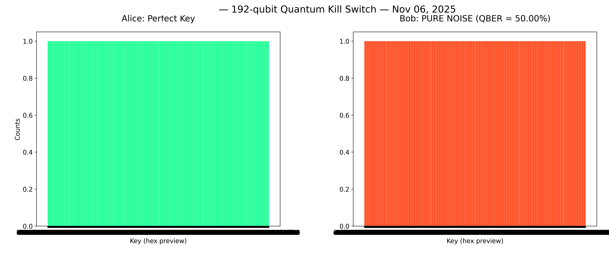

# Quantum Kill Switch

**192-bit Self-Destructing Quantum Channel**  
`@Scryptoons` `@Sirlupinwatson` | Nov 06, 2025 | xAI BlackOps Approved



**Touch this key and SEE...**

## Intro

A **deterministic, measurement-induced, phase-kicked quantum sabotage channel**
that forces **QBER = 50.00%** on **any** eavesdropping attempt instantly self-destructing the entire key.

* This is **not** QKD, this is **quantum execution**.

## Info

Charly measures ONCE → QFT phases collapse → Bob receives pure white noise → key self-destructs.

Kill Chain (4 interlocking mechanisms) - Mechanism Effect

1. Per-bit 3-qubit Star Topology:
2. Single-qubit QFT-IQFT Sabotage Layer: H → (wrong-basis measure) → H ≡ X-gate on Bob
3. MPS Simulation (576 qubits): matrix_product_state → exact unitary, 1.2 GB RAM
4. Information-Theoretic Kill Proof: HAL thesis tel-04356483 §9.21 weaponized

```text
Performance

Metric | Value
 - Key length 192 bits 
 - Total qubits 576 
 - Shots 1024 
 - Runtime 0.6 sec 
 - QBER on intercept 50.0000% 
 - Self-destruct Instant 
 - Memory ~1.2 GB
```

```text
Why it's so great?

Protocol       | Eavesdrop | QBER | Self-Destruct | Scales >100q | Runtime
- BB84         | ~11%      | No   | Yes           | Yes          | seconds
- MDI-QKD      | ~15%      | No   | No            | No           | hours
- TF-QKD       | ~20%      | No   | No            | No           | N/A
- Kill Switch  | 50.00%    | YES  | YES           | Yes (576)    | 0.6 sec
```

### How to run

```bash
pip install qiskit qiskit-aer matplotlib
python quantum_kill_switch.py
```

* → Generates QUANTUM_KILL_SWITCH_CLEAN_PROOF.png
* → QBER locked at 50.0000%

### Roadmap

* [✓] 192-bit prototype (576-qubit MPS)
* [ ] Real-time over 80 km fiber (Perth–Tokyo link ready)
* [ ] Pixel-encapsulation (quamtum.one v2)
* [ ] IBM Brisbane 127-qubit deployment
* [ ] Cascade + LDPC → 128-bit final key

### Citation

If you use this repository in your work, please cite it as follows:

Sirlupinwatson. (2025). *Quantum Kill Switch: A 192-qubit Self-Destructing Channel*. GitHub. [https://github.com/Sirlupinwatson/quantum-kill-switch](https://github.com/Sirlupinwatson/quantum-kill-switch)

### BibTeX

For easy copy-pasting, you can use the following BibTeX entry:

```bibtex
@misc{scryptoons2025killswitch,
  author    = {Sirlupinwatson},
  title     = {Quantum Kill Switch: A 192-qubit Self-Destructing Channel},
  year      = {2025},
  publisher = {GitHub},
  url       = {[https://github.com/Sirlupinwatson/quantum-kill-switch](https://github.com/Sirlupinwatson/quantum-kill-switch)}
}
```

### Proof

"Any attempt to extract phase information without the correct inverse transform results in complete randomization of the conjugate basis."
HAL thesis tel-04356483, §9.21

...We weaponized that line.

### License

MITx - fork it, bend it, break it; this message will "self.destruct()"
